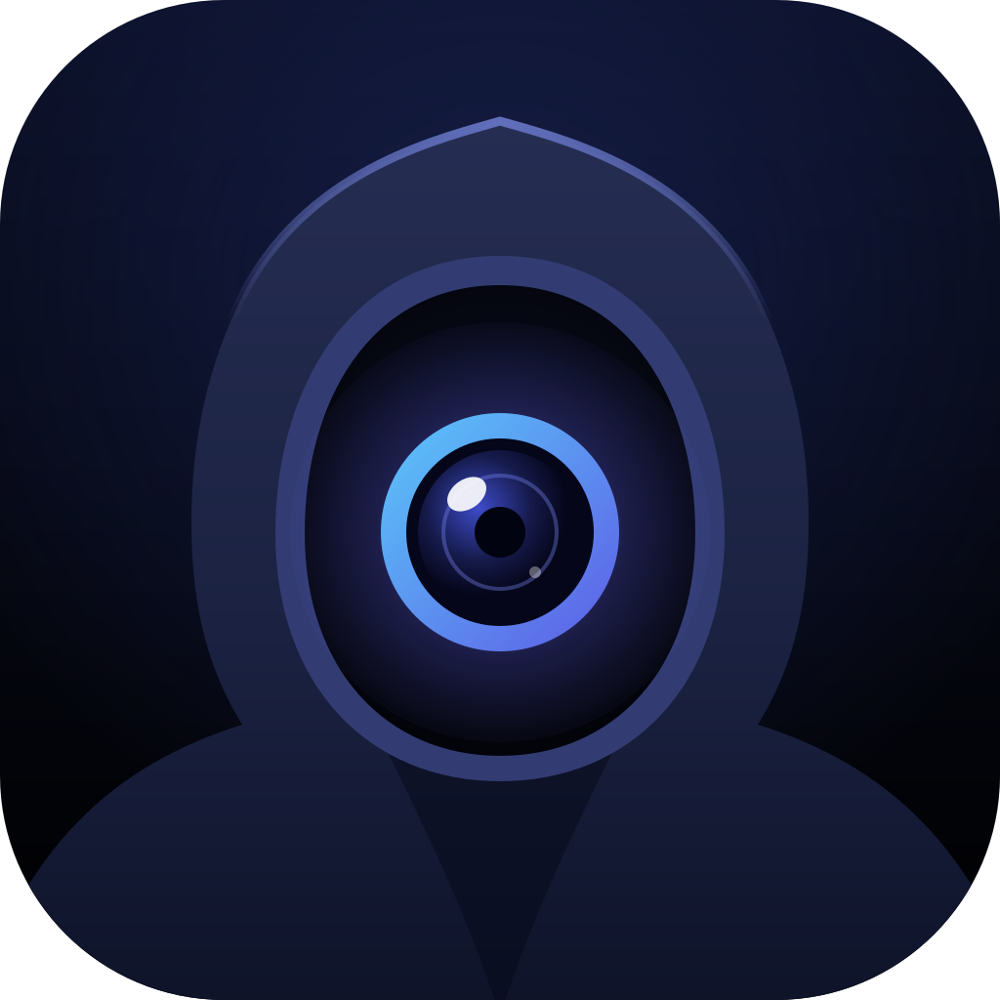

<p align="center"></p>

# Cipheroom

**Self-hosted, open-source video calls that your own server can't watch.**

Cipheroom is a Zoom / Telegram-style video calling app you run on your own machine. It's built for people who
want private calls without trusting a vendor, and it runs on a home computer with **no public IP and zero running cost**.

> [!WARNING]
> **Status: early development.** Every call is end-to-end encrypted: audio and video are encrypted in the browser,
> so neither your server nor Cloudflare's media server can see or hear them. The encryption is our own design on
> standard WebCrypto primitives and **hasn't been independently audited** yet. Compare the in-call safety code
> out loud when it matters, and remember that metadata (who, when, IP addresses) stays visible to the servers.
> See the [roadmap](#roadmap).

## Features

- 🎥 Group video and audio calls through [Cloudflare Realtime SFU](https://developers.cloudflare.com/realtime/sfu/)
  (simulcast; up to 4K, quality selectable; highest quality received by default)
- 🖥️ Screen sharing, camera switching (front/rear on phones), active-speaker highlight, automatic reconnect
- 🏠 Runs at home behind NAT or CGNAT: nothing at home needs to be reachable — ingress via Cloudflare Tunnel, media
  straight between browsers and Cloudflare's edge
- 💸 Free to run: uses only free tiers, and a usage guard keeps Cloudflare's traffic inside the free tier — video is
  capped at 80% of the month's allowance, calls go audio-only at 95% and pause at 99% until the month resets
  (thresholds in `deploy/.env`; Grafana shows the numbers)
- 📈 Optional self-hosted observability: traces, logs, metrics, call quality and Grafana dashboards — pseudonymous,
  kept 7 days, behind Grafana's login ([`docs/observability.md`](docs/observability.md))
- 🔐 End-to-end encrypted media: per-call keys, rotated whenever someone joins or leaves, and a safety code to
  compare out loud. Browsers that can't encrypt can't join — calls never fall back to unencrypted
- 💬 End-to-end encrypted chat with emoji reactions — signed by each sender, kept in memory only, gone when you
  leave; links stay plain links (no previews that would leak them)
- 🚪 Lobby and host controls: a meeting belongs to a host key kept in the creator's browser (with a
  passphrase-protected backup). Guests knock and wait; the host or a co-host lets them in, removes people, asks them
  to mute, or ends the call. Every decision is signed and checked by each browser, so even a malicious server can't
  slip anyone in — and display names never reach the server unencrypted

## How it works

```
Browser ──HTTPS/WSS──▶ Cloudflare Tunnel ──▶ nginx ──▶ .NET API (SignalR: rooms, media negotiation)
   │                                                     │ HTTPS (app secret, server-side only)
   └──media (WebRTC; TURN fallback)──▶ Cloudflare Realtime SFU ◀──┘
```

The API runs at home and only makes outbound connections. It relays each browser's WebRTC offers to Cloudflare's SFU
and checks that people only receive tracks from their own room; the media itself never passes through your machine.

| Component | Tech |
|---|---|
| Backend | .NET 10, ASP.NET Core, SignalR |
| Frontend | Angular 22, plain WebRTC |
| Media server | Cloudflare Realtime SFU (free tier: 1 TB/month egress, shared with TURN) |
| Ingress | Cloudflare Tunnel (`cloudflared`) on one hostname |
| NAT traversal | Not needed at home; Cloudflare Realtime TURN as fallback for restrictive client networks |
| Runtime | Docker Compose |

**Privacy model:** the API, Cloudflare's SFU and the TURN relay are all treated as untrusted. Every participant
encrypts media in the browser with keys exchanged as signed, encrypted envelopes. Servers only relay ciphertext.
Who may join is decided by signatures from the meeting's host key, which every browser checks itself, and display
names travel only end-to-end encrypted. Metadata (when, IP addresses, how many people, which random id is host)
remains visible to the servers and Cloudflare. With the optional observability stack, your own server also keeps pseudonymous call
metadata and call-quality numbers for 7 days (no names, IPs or plain room ids). Details:
[`docs/architecture.md`](docs/architecture.md).

## Quick start (local development)

Requirements: .NET 10 SDK, Node.js (LTS), and a Cloudflare Realtime SFU app (free; see step 2 below) — calls go
through Cloudflare even in development.

```bash
scripts/doctor.sh      # check your toolchain
scripts/secrets.sh     # creates deploy/.env — fill in CF_SFU_APP_ID / CF_SFU_APP_SECRET
scripts/dev.sh         # API on :5080 + Angular on :4200
```

Open http://localhost:4200, create a **New Meeting** (you're its host), and open the invite link in a second
browser window: it knocks, and you let it in from the People panel.

## Self-hosting

You need a domain on Cloudflare (the free plan is fine) and a machine running Docker. No port forwarding.

1. **Create `deploy/.env`**
   ```bash
   scripts/secrets.sh     # creates deploy/.env and lists what still needs filling in
   ```
2. **Cloudflare Realtime SFU** (required): Dashboard → Realtime → SFU → Create application. Put the app ID and app
   secret into `CF_SFU_APP_ID` and `CF_SFU_APP_SECRET`.
3. **Cloudflare TURN** (fallback for strict networks): Dashboard → Realtime → TURN Server → Create. Put the key ID and
   API token into `CF_TURN_KEY_ID` and `CF_TURN_API_TOKEN`.
4. **Cloudflare Tunnel**: Zero Trust → Networks → Tunnels → Create (Cloudflared, Docker).
   - Put the token into `TUNNEL_TOKEN`.
   - Add one public hostname, e.g. `call.example.com` → **HTTP** `web:8080`.
   - Use a *first-level* subdomain: the free Universal SSL certificate doesn't cover `a.b.example.com`.
5. **Hostname**: set `PUBLIC_HOST=call.example.com` in `deploy/.env`.
6. **Start**
   ```bash
   scripts/up.sh --tunnel
   scripts/security-check.sh https://call.example.com
   ```

To check it from real networks, join from a phone on mobile data (Wi-Fi off) and a laptop in the same meeting. To test
the TURN fallback, set `TURN_FORCE_RELAY=true` and run `scripts/up.sh --tunnel` again. Keep an eye on usage: 4K video
is ~3.6 GB per viewer-hour against the 1 TB/month free tier. The usage guard enforces it (best with
`CF_ACCOUNT_ID` / `CF_ANALYTICS_API_TOKEN` set); keep a Cloudflare billing notification as a second safety net.

### Operations

| Command | What it does |
|---|---|
| `scripts/up.sh [--tunnel] [--observability]` | Build and start the stack (`--observability`: Grafana at `/grafana/`, see [`docs/observability.md`](docs/observability.md)) |
| `scripts/down.sh` | Stop everything |
| `scripts/logs.sh [service]` | Follow logs (`api`, `web`, `cloudflared`, `otel-collector`, `grafana`, …) |
| `scripts/test.sh [--server\|--web]` | Run tests |
| `scripts/lint.sh [--fix]` | Formatting and lint |
| `scripts/security-check.sh [url]` | Secret scan, dependency audit, security headers |
| `scripts/secrets.sh` | Create `deploy/.env` and list required values that are still empty |

## Roadmap

- [x] Group calls through Cloudflare Realtime SFU — nothing at home reachable from the internet (works behind CGNAT)
- [x] Quality selection (up to 4K), simulcast, automatic reconnect
- [x] Single-hostname deployment via Cloudflare Tunnel
- [x] **End-to-end encryption**: per-call identities, sender keys, rotation on join/leave, safety codes
- [ ] Remember contacts' keys across calls (TOFU) — today identities are fresh per call
- [x] Lobby and host admission: host keys, signed tickets, co-hosts, remove, auto-admit, end for everyone
- [x] End-to-end encrypted chat: text, emoji reactions, links (no previews); memory only
- [x] Observability: traces, logs, metrics, call-quality reports, Grafana dashboards (self-hosted, optional)
- [x] Usage guard for the Cloudflare Realtime free tier (SFU + TURN): saving → audio-only → paused
- [ ] Connection diagnostics panel (hidden since the SFU switch)
- [ ] "Source" link in the UI (AGPL §13)
- [ ] MLS-based group keys for large rooms

## Project layout

```
src/          .NET API (Domain, Application, Infrastructure, Api)
tests/        .NET tests, one project per layer
web/          Angular app
deploy/       Docker Compose, nginx
scripts/      dev and ops scripts
docs/         architecture, signaling protocol, design plans
.claude/      Claude Code skills and settings used to develop this project
```

## Contributing

Issues and pull requests are welcome. Before opening a PR:

- `scripts/test.sh` and `scripts/lint.sh` pass
- Protocol changes update C#, TypeScript and [`docs/signaling-protocol.md`](docs/signaling-protocol.md) together
- Nothing sends keys, plaintext media or chat to any server. See [`CLAUDE.md`](CLAUDE.md) for the
  non-negotiable rules.

New features start as a short design in [`docs/plans/`](docs/plans/).

## Security

Please **don't** open public issues for vulnerabilities. Report them privately via GitHub's
"Report a vulnerability" (Security tab) once the repository is public.

## License

Cipheroom is licensed under the [GNU Affero General Public License v3.0](LICENSE).
If you run a modified version as a network service, you must offer its source code to your users.

The logo and app icons are licensed separately under [CC BY-SA 4.0](LICENSE-ASSETS.md).

Third-party components keep their own licenses. Media runs on Cloudflare Realtime (a hosted service, used within its
free tier); everything that runs on your machine is open source.